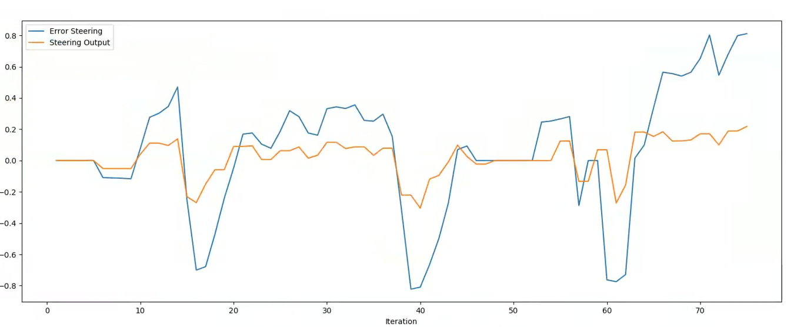
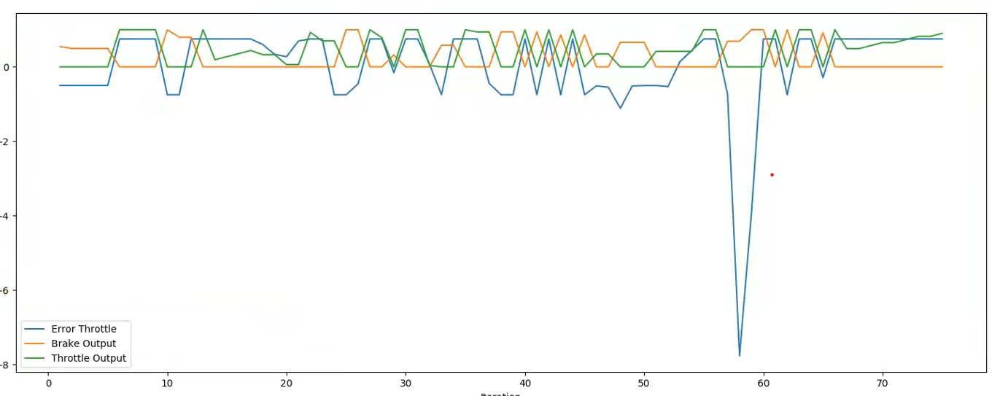

# Control and Trajectory Tracking for Autonomous Vehicle

In this project, you will apply the skills you have acquired in this course to design a Proportional-Integral-Derivative (PID) controller to perform vehicle trajectory tracking. Given a trajectory as an array of locations, and a simulation environment, you will design and code a PID controller and test its efficiency on the CARLA simulator used in the industry.

## Dependency - Udacity VM Workspace
The state code in this repository is aligned to run on the Udacity VM workspace. Refer to the classroom page **Ubuntu VM Workspace - Overview** to learn how to access the VM workspace and its restrictions and best practices. 

However, to set up your local machine with the necessary tools, you must have either *Windows Subsystem for Linux* (WSL) or *Ubuntu 20.04* or *18.04 LTS*. Below is the list of tools installed in the Udacity VM workspace that you should install on your local machine.

- [CARLA simulator 0.9.9.4](https://github.com/carla-simulator/carla/releases/tag/0.9.9). <br/>
    You can find more details at [CARLA Quick Start Installation](https://carla.readthedocs.io/en/latest/start_quickstart/). The deb installation is the easiest way to get the latest release in Linux.
    ```bash
    sudo apt-key adv --keyserver keyserver.ubuntu.com --recv-keys 1AF1527DE64CB8D9
    sudo add-apt-repository "deb [arch=amd64] http://dist.carla.org/carla $(lsb_release -sc) main"
    sudo apt-get update # Update the Debian package index
    sudo apt-get install carla-simulator=0.9.10-2 
    ```

    The installation directory must be **/opt/carla-simulator/** on your Linux machine. To verify, open a terminal an launch CARLA as:
    ```bash
    cd /opt/carla-simulator
    ./CarlaUE4.sh
    ```
    The Carla Simulator should launch in a few seconds. You can close it after verification. 


- [NICE DCV Server](https://docs.aws.amazon.com/dcv/latest/adminguide/setting-up-installing-linux-prereq.html). <br/>
    This includes the Nvidia drivers along with CUDA libraries for the underlying Tesla T4 GPU.

    ```bash
    Sat Oct 14 15:31:45 2023       
    +---------------------------------------------------------------------------------------+
    | NVIDIA-SMI 535.104.12             Driver Version: 535.104.12   CUDA Version: 12.2     |
    |-----------------------------------------+----------------------+----------------------+
    | GPU  Name                 Persistence-M | Bus-Id        Disp.A | Volatile Uncorr. ECC |
    | Fan  Temp   Perf          Pwr:Usage/Cap |         Memory-Usage | GPU-Util  Compute M. |
    |                                         |                      |               MIG M. |
    |=========================================+======================+======================|
    |   0  Tesla T4                       On  | 00000000:00:1E.0 Off |                    0 |
    | N/A   31C    P0              27W /  70W |   2093MiB / 15360MiB |     27%      Default |
    |                                         |                      |                  N/A |
    +-----------------------------------------+----------------------+----------------------+
                                                                                            
    +---------------------------------------------------------------------------------------+
    | Processes:                                                                            |
    |  GPU   GI   CI        PID   Type   Process name                            GPU Memory |
    |        ID   ID                                                             Usage      |
    |=======================================================================================|
    |    0   N/A  N/A      1055      G   /usr/lib/xorg/Xorg                           67MiB |
    |    0   N/A  N/A      1521      G   /usr/lib/xorg/Xorg                           89MiB |
    |    0   N/A  N/A      1669      G   /usr/bin/gnome-shell                         23MiB |
    |    0   N/A  N/A      1948    C+G   /usr/lib/x86_64-linux-gnu/dcv/dcvagent      398MiB |
    |    0   N/A  N/A      3320      G   ...sion,SpareRendererForSitePerProcess       30MiB |
    |    0   N/A  N/A      4489    C+G   ...aries/Linux/CarlaUE4-Linux-Shipping     1348MiB |
    +---------------------------------------------------------------------------------------+
    ```


    ```bash
    dcv version
    # Output
    NICE DCV 2023.0 (r15487)
    Copyright (C) 2010-2023 NICE s.r.l.
    ```

- C++ 
    ```bash
    gcc --version
    # Output
    gcc (Ubuntu 9.4.0-1ubuntu1~20.04.2) 9.4.0
    ```
- Git
- [OpenCV](https://docs.opencv.org/4.x/d7/d9f/tutorial_linux_install.html)
- [CMake](https://askubuntu.com/questions/161104/how-do-i-install-make) and Make
- [VSCode](https://code.visualstudio.com/download)
- [Eigen Library for C++](https://eigen.tuxfamily.org/index.php?title=Main_Page)
- [Point Cloud Library](https://pointclouds.org/downloads/)
- Python3 and Pip v20.xx or above. 
    ```bash
    python3 --version
    # Output
    Python 3.8.10
    ```
- ROS

- Project specific dependencies
    ```bash
    # Required for building project
    sudo apt-get install -y libgoogle-glog-dev libgtest-dev
    # Required for running project. 
    # Install carla python package
    sudo python3 /usr/lib/python3/dist-packages/easy_install.py /opt/carla-simulator/PythonAPI/carla/dist/carla-0.9.9-py3.7-linux-x86_64.egg
    # Install python requirements
    pip install pandas matplotlib numpy pygame websocket-client
    ```

# Instructions
The sections ahead will guide you through the steps to build and run the project. 

## Step 1. Log into VM Workspace

Open the VM workspace and log into the VM to practice the current project. 
Once you log into the VM, open a Terminal window. 

<br/><br/>

## Step 2. Clone the Repository

Fork the repository to your Github account and clone the repository to the workspace using the commands below. 

```bash
git clone https://github.com/udacity/nd013-c6-control-starter.git
```

Change to the project directory.
```bash
cd nd013-c6-control-starter/project
```

<br/><br/>

## Step 3. Review the starter files
You will find the following files in the project directory.

```bash
.
├── cserver_dir
├── install-ubuntu.sh
├── manual_control.py
├── pid_controller/     # TODO Files
├── plot_pid.py
├── run_main_pid.sh
├── simulatorAPI.py
├── steer_pid_data.txt
└── throttle_pid_data.txt
```

<br/><br/>

## Step 4. Start the Carla Server
Start the Carla server by executing the following shell script. 
```bash
/opt/carla-simulator/CarlaUE4.sh
```


<br/><br/>

## Step 5. Install Dependencies
Open another Terminal tab, and change to the **nd013-c6-control-starter/project**  directory. Execute the following shell script to install the project-specific dependencies. 
```bash
./install-ubuntu.sh
```
This file will install utilities such as, `libuv1-dev`, `libssl-dev`, `libz-dev`, `uWebSockets`. 

<br/><br/>

## Step 6. Update the Project Code

Change to the **pid_controller/** directory.
```bash
cd pid_controller/
```
Before you start coding, we strongly recommend you look at the rubric in your classroom, against which the human Mentor will review your submission. Your submission must satisfy all rubric criteria to pass the project; otherwise, the Mentor may ask you to re-submit. 


Update the following files as per the classroom instructions. You will TODO markers as well in these files. 

- **pid_controller.h**
- **pid_controller.cpp**
- **main.cpp**


<br/>

> **Important**: At this moment, it is important to save your work and push it back to the remote Github repository. 

<br/><br/>

### Update Notes
In the previous version of the project starter code, we had **libcarla-install/** and **rpclib/** directories inside the **pid_controller/** directory. But, those directories are no longer needed in the current version of the starter code because the current **CMakeLists.txt** file has corresponding `includes` and `libs` added at `/opt/carla-source`.

To give some old context, when we had **rpclib/** directory inside the starter files, we used to compile the **rpclib** library using the following commands. 
```bash
cd pid_controller/
rm -rf rpclib
git clone https://github.com/rpclib/rpclib.git
```
This library is a **msgpack-rpc** library written using modern C++. The goal of building this library was to provide a simple RPC solution. However, all of the above-mentioned steps are **no longer needed** in the current version of the project strarter code. 

<br/><br/>

## Step 7. Build and Execute the Project

When you finish updating the project files, you can execute the project using the commands below. 

```bash
# Build the project
# Run the following commands from the pid_controller/ directory
cmake .
# The command below compiles your c++ code. Run it after each time you edit the CPP or Header files
make
```

```bash
# Run the project
cd ..
# Run the following commands from the nd013-c6-control-starter/project directory
./run_main_pid.sh
```
If the execution fails silently, you can use **ctrl + C** to stop, and try again. 

Another possible error you may get is `bind failed. Error: Address already in use`. In such a case, you can kill the process occupying the required port using the commands below.

```bash
ps -aux | grep carla
# Use the IDs displayed in the output of the last command. 
kill id     
```

Draw the graph

```bash
# Install lib
pip3 install pandas 
# Run the following commands from the nd013-c6-control-starter/project directory
python3 plot_pid.py
```

<br/><br/>

## Step 8. Check the Rubric and Submit

Re-check the rubric in the classroom and ensure that your submission satisfies all rubric criteria to pass the project. Once you are confident, submit the project. 

### Code quality

- Use of command lines on a Linux terminal.
  
The project runs commands on the terminal and to compile and test code through command lines on a Linux terminal.

- The documentation is well utilized.

The README file includes a summary of the project, how to run the scripts, and an explanation of the files in the repository. Comments are used effectively.

### Build the PID controller object

- The code runs without errors and generates two PID objects.

The scripts “main.cpp”, “pid_controller.cpp” and “pid_controller.h” compile without errors and when “run_main_pid.sh” runs without error.

- Code a discretized integrator and derivator.
	
The function “UpdateError” should compute the derivative and integration part of the PID. The function updates the errors for the proportionate, integral and derivative terms.

- Understand C++ class structure

All variable and methods are completed in the file  “pid_controller.h” and “pid_controller.cpp”

The PID object instances (pid_steer and pid_throttle) are initialized in the “main.cpp” code.

### Adapt the PID controller to the simulation

- Understand the car dynamics and how to compute an error with a trajectory.

The script uses the variables described in the README and computes the error between the position and the trajectory for the speed and the yaw. The code is clearly commented.

- Tune and test the PID on the simulation

error_steer are updated in the "main.cpp"

### Evaluate and analyze the PID controller

- Plot the results of the simulation.

**Steering plot:**



The PID controller have Kp = 0.23, Ki = 0.0001, Kd = 0.24, max = 1.0, min = -1.0.

This figure is the plot of the steering command data. The PID controller design choice to clip the minimum / maximum steering allowed from ± 1.0 rad.

Due to limited time, the PID controller's numerical calibration is still not accurate, so at some points the steering error is still large.

**Throttle plot:**



The PID controller have Kp = 0.55, Ki = 0.11, Kd = 0.65, max = 1.0, min = -1.0.

The system has a coefficient Kd larger than kp, when the vehicle exceeds the desired position, the coefficient kd will pull the vehicle back to the desired position, because the coefficient kd is large, sometimes there will be a phenomenon of sudden braking at some positions on the graph.

### Answer the questions:

- What is the effect of the PID according to the plots, how each part of the PID affects the control command? The answer explains the role of the different parts of the PID.

**Proportional (P):** Provides quick response to error but may not eliminate steady-state error.

**Integral (I):** Eliminates steady-state error over time but can lead to overshoot and slower response.

**Derivative (D):** Improves stability and damping, reducing overshoot and providing smoother control.

- How would you design a way to automatically tune the PID parameters? This is an open question, the coherence and justification of the answer is valued.

**Adaptive Tuning** :Monitor system behavior in real time and adjust parameters dynamically based on feedback. Techniques include:

Recursive Least Squares (RLS) to estimate system parameters and adapt the PID gains.

Gain Scheduling to vary PID parameters based on operating conditions (e.g., speed or load).

- PID controller is a model free controller, i.e. it does not use a model of the car. Could you explain the pros and cons of this type of controller? Find at least 2 pros and cons for model free versus model based.

**Pros:**

**Simplicity:** Model-free controllers like PID are easy to implement and demand little understanding of the system's internal dynamics, making them flexible and suitable for various applications.

**Handle Complex Systems:** These controllers are highly effective in controlling multi-variable, non-linear, and time-varying systems, where variable interactions demand advanced control methods. In the past, I also used this controller to operate a Segway.

**Cons:**

**Complexity and Cost:** Creating an accurate model demands considerable effort, specialized knowledge, and computational resources, making these controllers more challenging to access and costly to implement.

**Sensitivity to Model Accuracy:** The performance of the controller relies greatly on the precision of the system model, with any errors or unaccounted dynamics potentially causing instability or reduced effectiveness.

- (Optional) What would you do to improve the PID controller? This is an open question, the coherence and justification of the answer is valued.

Modify the proportional, integral, and derivative terms dynamically based on error magnitude to prevent saturation or excessive corrections.

Can use observers like Kalman filters or some other filters to estimate unmeasured states or reduce noise in the feedback signal. This enhances the controller's robustness and accuracy in noisy environments.